# End-to-end encrypted data sharing between AtSigns

## Simple logical sequence diagram
@alice sharing data with @bob, encrypted so that only @bob can decrypt (aka end-to-end-encrypted or e2ee)
```mermaid
sequenceDiagram
    participant @alice
    participant @bob

    note over @alice, @bob : If @alice has not already created a shared secret for @alice-to-@bob ...
    @alice ->> @bob : Get the public key from @bob's asymmetric encryption keypair
    @bob ->> @alice : [@bob's public key]
    @alice ->> @alice : Create symmetric encryption key <br/> [@alice-to-@bob-shared-secret]
    @alice ->> @alice : Encrypt [@alice-to-@bob-shared-secret] <br/> with @bob's public key
    @alice ->> @bob : Send [@alice-to-@bob-shared-secret] <br/> decryptable only by @bob's private key
    @bob ->> @bob : Decrypt [@alice-to-@bob-shared-secret] <br/> using [@bob's asymmetric encryption private key]

    note over @alice, @bob : @alice and @bob now have a <br/> shared secret for encryption/decryption

    @alice ->> @alice : Encrypt 'Hello, Bob!' using <br/>[@alice-to-@bob-shared-secret]
    @alice ->> @bob : [ciphertext] 
    @bob ->> @bob : Decrypt [ciphertext] using <br/>[@alice-to-@bob-shared-secret]
    note over @bob : Hello, Bob!
```

## More detailed code paths / data flow
Note: This is still a bit simplified, but does enumerate the critical pieces of the code path and data flow

**TODO**: Add more hyperlinks to the code on GitHub
**TODO**: Find a way to keep hyperlinks reasonably up to date given there will be code drift over time

```mermaid
flowchart TB
    subgraph AliceClient
        A[Client code]-->ATCIP

        subgraph ATC[AtClientImpl]
            style ATC fill:#39f
            direction TB
            ATCIP["AtClientImpl.put('@bob:12345.messages.bob.chats.myapp.example.com@alice', 'Hello, @bob!')"]
            click ATCIP "https://github.com/atsign-foundation/at_client_sdk/blob/trunk/at_client/lib/src/client/at_client_impl.dart" "View AtClientImpl.put on GitHub"
            subgraph PRT["PutRequestTransformer"]
                style PRT fill:#cbc
                PRT.transform["transform ('@bob:12345.messages.bob.chats.myapp.example.com@alice', 'Hello, @bob!')"]
                click PRT.transform "https://github.com/atsign-foundation/at_client_sdk/blob/trunk/at_client/lib/src/transformer/request_transformer/put_request_transformer.dart" "View PutRequestTransformer.transform on GitHub"
                subgraph SKE["SharedKeyEncryption"]
                    style SKE fill:#bcc
                    SKE.encrypt["SharedKeyEncryption.encrypt('@bob:12345.messages.bob.chats.myapp.example.com@alice', 'Hello, @bob!')"]
                    subgraph AKE["AbstractAtKeyEncryption"]
                        style AKE fill:#ccb
                        AKE.encrypt["AbstractAtKeyEncryption.encrypt('@bob:12345.messages.bob.chats.myapp.example.com@alice', 'Hello, @bob!')"]
                        AKE.getSharedKey["AbstractAtKeyEncryption.getSharedKey('@bob:12345.messages.bob.chats.myapp.example.com@alice')"]
                        AKE.gcsk["_getCachedSharedKey : look up 'shared_key.bob@alice' in local datastore"]
                        AKE.fcsk
                        AKE.rlsk["_getSharedKeyFromRemote : <br/>call 'llookup:shared_key.bob@alice' on remote secondary"]
                        AKE.frsk
                        subgraph AKE.csk["_createSharedKey"]
                            direction TB
                            GetBobsPublicKey-->CreateAESKey
                            CreateAESKey["CreateAESKey @alice-to-@bob-shared-secret"]
                            CreateAESKey-->EncryptWithBobsPublicKey
                            EncryptWithBobsPublicKey-->update["send to @bob"]
                            CreateAESKey-->EncryptWithAlicesPublicKey
                            EncryptWithAlicesPublicKey-->save["store for @alice to reuse later"]
                        end
                    end
                    SKE.encryptValue["SharedKeyEncryption.encryptValue('Hello, Bob!', @alice-to-@bob-shared-secret)"]
                end
            end
            subgraph Secondary
                style Secondary fill:#aba
                Secondary.executeVerb
                Secondary.DoTheUpdate["Either <br/>(1) Do the local update and wait for sync if using local secondary <br/>or<br/>(2) marshall the update: command and send to remote secondary.<br/><br/>In either event, we end up sending an update command to @alice's secondary server"]
            end
        end
    end
    subgraph CSS_a["@alice Cloud Secondary Server"]
        style CSS_a fill:#f80
        CSS_a.UpdateVerbHandler-->CSS_a.Store
        CSS_a.Store-->CSS_a.NotifyBobSecondary
        CSS_a.NotifyBobSecondary-->PrepareNotifyCommand
        PrepareNotifyCommand-->ConnectToBobSecondary
        ConnectToBobSecondary-->CSS_a.SendNotifyCommandToBob
    end
    CSS_a.SendNotifyCommandToBob-->CSS_b
    subgraph CSS_b["@bob Cloud Secondary Server"]
        style CSS_b fill:#08f
        CSS_b.NotifyVerbHandler["NotifyVerbHandler"]
        CSS_b.NotifyVerbHandler-->CSS_b.Store["Store to dataStore"]
        CSS_b.NotifyAnyConnectedClients["Notify any connected @bob clients"] 
        CSS_b.Store-->CSS_b.NotifyAnyConnectedClients
        CSS_b.NotifyAnyConnectedClients-->BobMonitor
    end
    
    subgraph BobClient
        BobMonitor
        BobMonitor-->BobClientTODO
        BobClientTODO["TODO: Still need to flesh out what happens on @bob client side"]
    end
    
    ATCIP-->PRT.transform
    PRT.transform-->SKE.encrypt
    SKE.encrypt-->AKE.encrypt
    AKE.encrypt-->AKE.getSharedKey
    AKE.getSharedKey-->AKE.gcsk
    AKE.gcsk-->AKE.fcsk{Found in Local Datastore?}
        AKE.fcsk-->|Yes| SKE.encryptValue
        AKE.fcsk-->|No| AKE.rlsk
            AKE.rlsk-->AKE.frsk{Found in remote Secondary?}
                AKE.frsk-->|Yes| SKE.encryptValue
                AKE.frsk-->|No| AKE.csk
            AKE.csk---->SKE.encryptValue
    SKE.encryptValue-->Secondary.executeVerb
    Secondary.executeVerb-->Secondary.DoTheUpdate
    Secondary.DoTheUpdate-->CSS_a.UpdateVerbHandler
```


